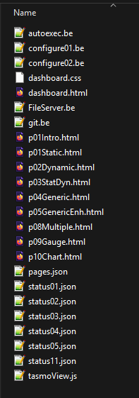

# More Information about TasmoView

## Extract File in TasmoView.tapp

Each tapp-file is an uncompress zip-file.

Change the name from tasmoView.tapp to tasmoView.zip. 
This will allow you to extract all files.




- dashboard.html,dashboard.css
    - the container for the page-files p0*.html
  
- tasmoView.js
  - the basic js-library for TasmoView
 
- *.be, autoexec.bat
  - executed by berry
  
- pages.json
  - the parameters for the application

- status*.json
  - only required, if application is NOT served by a ESP32-Controller
  - simulators for the command-response
  

## Offline evalulation or development

The application can be developed offline using familiar tools.
The extracted files are simply static files which can be hosted by any web server. (e.g. Live-Server extension of VS-Code)

TasmoView automatically detects that it is not hosted by a Tasmota controller.
In the script of p01Intro.html the mapping to the status*.json files is implemented.

A change of a value whithin this file is immediately displayed in the UI.

```js
    if (TasmoView.isSimulated) { // in case of test-environment on pc
      TasmoView.map_command("status01", "status01.json")
      TasmoView.map_command("status02", "status02.json")
      TasmoView.map_command("status04", "status04.json")
      TasmoView.map_command("status05", "status05.json")
      TasmoView.map_command("status11", "status11.json")
    }

```

This means that the application can be developed completely offline with all tools (debugger ...)


## Some basic rules of TasmoView

### All parameters are defined in the file pages.json

- app.title
  - the title of the application 
- app.cmds_onTimer
  - tasmota commands that are always executed regardless of the selected page 

- pages
  - is an array of page-descriptions
  - the first item is load as default page
  - the order is also reflected by the menu-structure
  
- pages.item.name    
  - the file name of the associated html-page
  - this is loaded only once, when first requested
  
- pages.item.label
  - the name of the page inside the menu

- pages.item.cmds-onSelect 
  - description for tasmota-commands executed, when page is loaded
  - the property-name is the identfier for the command (e.g. status01)
  - the property-value is the associated tasmota-command (/cm?cmnd=status%201)

- pages.item.cmds_onTimer
  - description for tasmota-commands executed on timer-tick (each 5 seconds)


### Content-Files

The content files (p0*.html) contain all information that replaces HTML elements in Dashboard.html after a page change.

- The current element of with id="content" is replaced with those in the content-file.
- The first script-element without external link is executed after page is loaded


