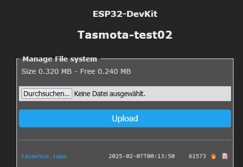
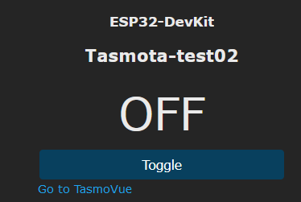
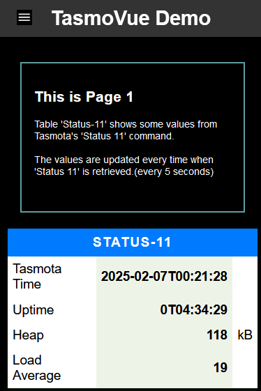
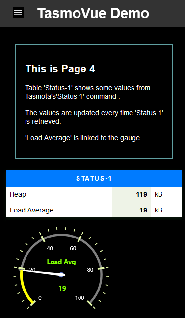

# TasmoVue

Tasmota-UI made with support from [Petite Vue](https://github.com/vuejs/petite-vue)

Basic ideas for project-motivation

- with Berry, Tasmota becomes a very powerful embedded solution
- the current UI is quite useful for "administrators", but cannot meet the needs for end users.

TasmoVue is an experiment that attempts to improve Tasmota's limited UI-features.

## Features

- The UI is completely reactive, only dynamic parts of the web page linked to process data are changed at runtime
- The html-pages are cached and loaded only once.
- The single-page architecture minimizes access to Tasmota. At the same time, the pages are built very quickly.
- The web pages can be developed using standard tools.
- The development of the web pages can be done using standard tools and is therefore much faster and easier than with Tasmota/Berry.
- The browser, not Tasmota, bears most of the burden of this new technology.

The project is currently still in the first development phase.

With this preliminary version, interested users have the opportunity to provide criticism and suggestions.

## How to use the demo application

This only works for ESP32 based Tasmota.

Upload the "tasmoVue.tapp" file to Tasmota's file system and restart Tasmota.

Click "Go to TasmoVue"

After that the a new Tab is opened in Browser

-------

-------

